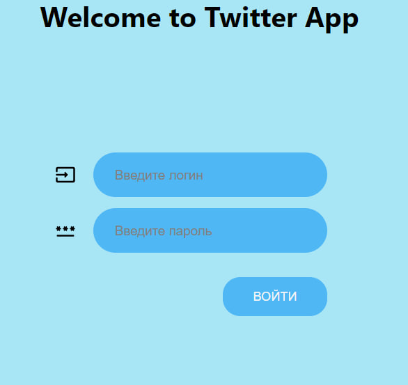
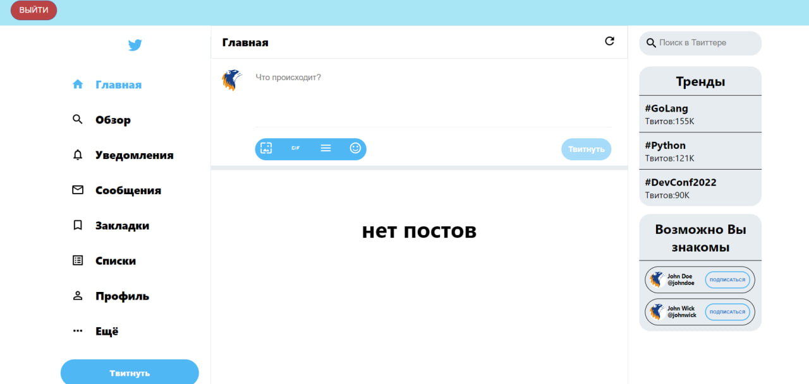
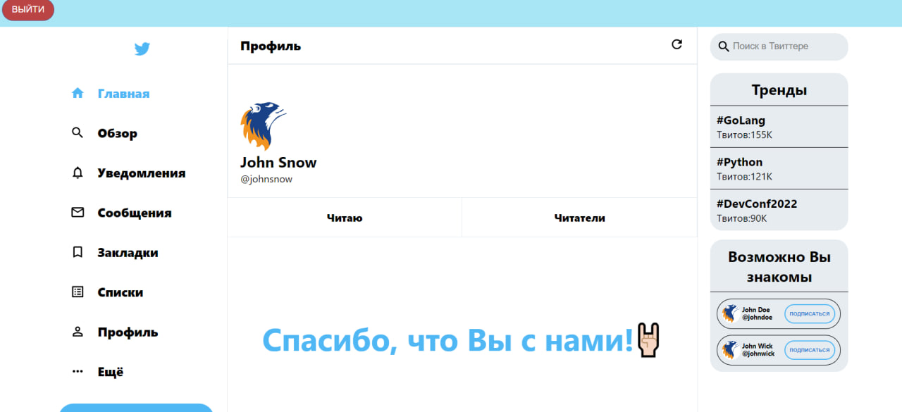

# Twitter Clone App

### Database has three users:

| User      | Username | Password |
|-----------|----------|----------|
| John Wick | johnwick | secret   |
| John Doe  | johndoe  | secret   |   
| John Snow | johnsnow | secret   |


### Running with Docker
   * run app
```commandline
docker-compose up -d --build
```

### Swagger
**Generate API documentation. Go to localhost:8000/docs**

| Method | Path                          | What                                                 |
|--------|-------------------------------|------------------------------------------------------|
| GET    | /api                          | Welcome message                                      |
| POST   | /api/token                    | Generate token                                       |   
| GET    | /api/users                    | Info about users, except current user                |
| POST   | /api/users/{whom_user}/follow | read user                                            |
| DELETE | /api/users/{whom_user}/follow | stop readin' user                                    |
| GET    | /api/users/me                 | get info about followings and followers current user |
| GET    | /api/users/{id_user}          | get info about followings and followers user by id   |
| DELETE | /api/tweet/{id_tweet}         | delete your own tweet                                |
| POST   | /api/tweet/{id_tweet}/likes   | like on tweet                                        |
| DELETE | /api/tweet/{id_tweet}/likes   | remove like on tweet                                 |
| GET    | /api/tweets                   | tweets                                               |
| POST   | /api/tweets                   | create tweet                                         |
| POST   | /api/medias                   | upload image                                         |
     

### Login page
**Go to localhost:3000**

**Enter the username and password of one of the data pairs in the database**






